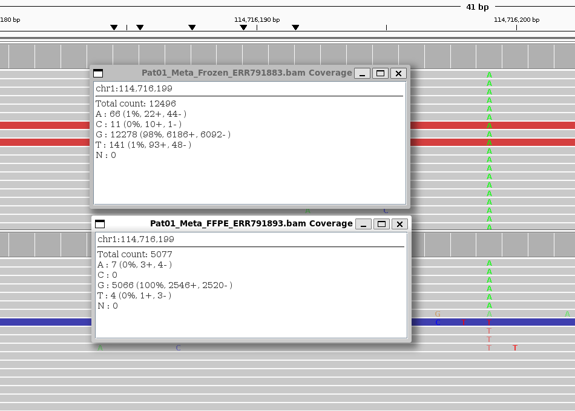
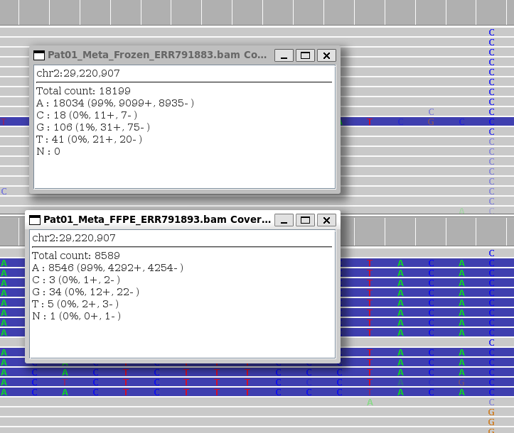

# Analysis of paired FFPE - fresh frozen samples

## Description
Here we use data from various datasets from the European Nucleotide Archive (ENA) to compare the performance of various FFPE artifact filtering tools on paired FFPE and Fresh Frozen samples in the dataset.

## Dependencies
- python
- R
- samtools
- bcftools
- cromwell
- GATK
- gsutil
- rgsam ([djhshih/rgsam](https://github.com/djhshih/rgsam))
- dlazy ([djhshih/dlazy](https://github.com/djhshih/dlazy/tree/main))
- openjdk

### R packages
- tidyverse
- io
- precrec
- jsonlite
- argparser
- glue
- patchwork
- grid
- hrbrthemes
- viridis
- Rsamtools
- BiocGenerics
- Biostrings
- doParallel

### Python Libraries
- polars
- pysam
- pandas
- numpy
- matplotlib
- seaborn


### FFPE Artifact Filtering tools

- htspan ([djhshih/htspan](https://github.com/djhshih/htspan))
    - MOBSNVF
    - VAFSNVF
- MicroSEC ([MANO-B/MicroSEC](https://github.com/MANO-B/MicroSEC))
- SOBDetector (included)
- FFPolish
- Ideafix
- GATK Orientation Bias Mixture Model (Included with GATK Mutect2)


## Replication

1. Clone the repository:
    ```bash
    git clone --recursive https://github.com/djhshih/analysis-ena-ffpe.git
    ```

2. Install all the dependencies listed above.

3. Navigate to the `data` directory and run:

    ```bash
    bash get_gatk_data.sh
    cd ref
    bash get.sh
    ```
    This will download the reference genome and additional data from broadinstitute.org to be used later in the analysis.

Then each dataset can be processed by following the steps below. Replace `<dataset_id>` with the actual dataset ID (e.g., `PRJEB8754`).

4. Navigate to the `annot/<dataset_id>` directory and run the following:
    ```bash
    get.sh
    python annot.py
    ```
    This will generate several annotation files which will be used later in our analysis.

5. Navigate to the `data/<dataset_id>/fq` directory and run `fastq_ftp_download.sh`:
    ```bash
    bash fastq_ftp_download.sh
    ```
    This will download the FASTQ files from ENA.

6. Navigate to the `data/<dataset_id>/rg` directory and run `get-fq-head.sh` followed by `rgsam.sh`:
    ```bash
    bash get-fq-head.sh
    bash rgsam.sh
    ```
    This will generate the read group information for the FASTQ files.

    Some directories may contain `rg_fix.py`. Run this script if present. This will fix rg information for fastq formats too outdated for `rgsam` to infer read groups from.

    ```bash
    python rg_fix.py
    ```

7. Navigate to the `analysis/<dataset_id>/fastq` aligned pair directory and run the following:
    ```bash
    python prepare.py
    bash align_fastqs.sh
    python link.py
    ```
    This will align the FASTQ files to the reference genome and generate BAM files.

8. Navigate to the `vcf/<dataset_id>/bam_variant_mutect2` directory and run:
    ```bash
    python prepare.py
    bash call_variants_mutect2.sh
    python link.py
    ```
    This will call variants using Mutect2 on the aligned BAM files.

9. Navigate to the `ffpe-snvf/<dataset_id>/ffpe_artifact_filtering` directory and run:
    ```bash
    python create-scripts.py
    bash ffpe-snvf.sh
    python make-microsec-inputs.py
    bash ffpe-snvf_microsec.sh
    ```
    This will prepare the outputs from each ffpe artifact filtering tool to be used for performance evaluation.
    Outputs will be saved in the `ffpe-snvf/<dataset_id>`

10. Navigate to the `eval/<dataset_id>` directory and run:
    ```bash
    Rscript eval-gatk-obmm_somatic_precrec.R
    Rscript eval-mobsnvf_somatic_precrec.R
    Rscript eval-vafsnvf_somatic_precrec.R
    Rscript eval-sobdetector_somatic_precrec.R
    Rscript eval-microsec_somatic_precrec.R
    Rscript combine-results.R
    Rscript make-plots_somatic.R
    ```
    This will generate performance evaluations - ROC & PRC plots, AUC tables and SNV scores table for each FFPE filter with ground truth annotations in the `eval/<dataset_id>` directory.

## Datasets

The datasets are from the European Nucleotide Archive (ENA) which have matched FFPE and Fresh Frozen (FF) samples.

1. **[PRJEB8754](https://www.ebi.ac.uk/ena/browser/view/PRJEB8754)** - This dataset contains match FFPE and FF samples from 10 patients from the metastasis stage of colorectal cancer. There are also 4 additional FFPE samples from the primary stage of the same patients.

    - Status: Processed
    - Type: Amplicon Sequencing
    - Tissues: Colorectal
    - Publication: https://journals.plos.org/plosone/article?id=10.1371/journal.pone.0127146

2. **[SRP044740](https://www.ebi.ac.uk/ena/browser/view/SRP044740)** - This dataset contains exome sequence of 13 Matched FFPE and Fresh Frozen samples from breast cancer patients. Each patients have 1 to 3 FFPE samples and 1 matched FF sample. 

    - Status: Processed
    - Type: Whole Exome Sequencing (WXS)
    - Tissues: Breast
    - Publication: No publication found.

3. **[PRJEB44073](https://www.ebi.ac.uk/ena/browser/view/PRJEB44073)** - Whole Exome Sequencing (WXS) of 16 matched fresh frozen and FFPE gastro-oesophageal tumours' samples.

    - Status: Processing
    - Type: Whole Exome Sequencing (WXS)
    - Tissues: Gastro-oesophageal
    - Publication: https://www.mdpi.com/2077-0383/10/2/215

4. **[SRP065941](https://www.ebi.ac.uk/ena/browser/view/SRP065941)** - Whole Exome Sequencing (WXS) of 4 matched fresh frozen and FFPE samples.

    - Status: Processing
    - Type: Whole Exome Sequencing (WXS)
    - Tissues: Undisclosed
    - Publication: https://doi.org/10.1371/journal.pone.0144162


## Variant Calling Decisions

Variants were called using GATK Mutect2 with matched normal if they were available. Otherwise the variant calling was done in tumor-only mode.

Panel of Normals (PON) and Germline Resource provided by the broad institute as demonstrated in the GATK best practices pipeline were used.

For WES data, Mutect2 was run with default parameters. However, for the amplicon data a few additional parameters were used as the default parameters were not suitable for amplicon data. These parameters are explained in the next section. The sources for these decisions are listed below:

https://www.biostars.org/p/448808/

https://gatk.broadinstitute.org/hc/en-us/community/posts/360059696811-Mutect2-not-calling-a-4-bp-deletion-in-BRCA1-with-50-AF

https://gatkforums.broadinstitute.org/gatk/discussion/24507/mutect2-repeatedly-not-detecting-somatic-variant-idh2-r172k-with-solid-read-support-and-5-af

https://gatk.broadinstitute.org/hc/en-us/community/posts/360057582511-HaplotypeCaller-data-generated-from-amplicon-sequencing

https://gatk.broadinstitute.org/hc/en-us/community/posts/12450796994459-Asking-for-advice-on-Mutect2-calling-in-somatic-but-amplicon-data

https://www.reddit.com/r/bioinformatics/comments/a71z2f/running_mutect2_with_dontusesoftclippedbases/

## Issues


### Mutect2 and Amplicon Sequencing
There are too many reads in amplicon sequencing so mutect2 needed to be run with special flags suitable to account for the nature of amplicon data.

Extra flags used for Mutect2: 

```
--disable-read-filter NotDuplicateReadFilter --downsampling-stride 50 --linked-de-bruijn-graph --max-reads-per-alignment-start 0 --annotations-to-exclude StrandBiasBySample --annotations-to-exclude ReadPosRankSumTest

```

Reasoning for these flags:
- `--disable-read-filter NotDuplicateReadFilter`: This is used to avoid filtering out reads that are marked as duplicates, which is common in amplicon sequencing.
- `--downsampling-stride 50`: This is used to reduce the number of reads processed by Mutect2, which is necessary due to the high coverage in amplicon sequencing. 
- `--linked-de-bruijn-graph`: This is used to improve the sensitivity of variant calling in amplicon sequencing.
- `--max-reads-per-alignment-start 0`: This is used to avoid downsampling reads at the start of an alignment, which can be problematic in amplicon sequencing.
- `--annotations-to-exclude StrandBiasBySample`: This is used to exclude the strand bias annotation, which is not relevant for amplicon sequencing as it is often seen that different PCR primer pairs have differet efficiencies leading to once strand being amplified faster than the other leading to strand bias.
- `--annotations-to-exclude ReadPosRankSumTest`: This is used exclude penalizing variants which appear reads near the start or the end of the read in too many reads. This is not relevant for amplicon sequencing as the reads are of fixed length and the variants are expected to appear at the same position in most of the reads.


### FFPE vs Fresh Frozen Variant Intersection
From the VCFs we see that a lot of variants are called in FFPE but not in Fresh Frozen and vice versa. Some of this can be attributed to tumor heterogeniety and artifacts. But opening up the BAM files of an FFPE and matched Fresh Frozen sample in IGV, we can see that a variant called in FFPE is still present in the Fresh Frozen sample or vice versa albeit with either lower number of reads supporting it or with stronger strand bias.

Example: In the Pat01 sample from PRJEB8754, we can see that for Chr1:114,716,199 a G>T mutation was called in the FF VCF but was not Present in the FFPE VCF. However, upon inspection in IGV we can see that the variant is present in the FFPE sample too despite in exremely low proportion.



In another example from the same patient, we can see that in CHR2:29220907 a A>G mutation was called in both FFPE and but was not present in the FF VCF. Upon isnpection in IGV we can see that the variant is present in the FF sample too and also with a higher propertion of reads supporting the alternative allele, albeit with a stronger strand bias.




Some variants appear in both FF and FFPE but get called in one due to a slightly higher frequency. We have to find a way to adjust the variant calling so that the variants are more reliable for benchmarking.

### Issues

Fastq was corrupted for one of Sample_B83_0029 from the PRJEB44073 repository. This sample was skipped from any further analysis.

### VCF Filtering

To ensure quality of the variants called, the VCFs from Mutect2 after the `FilterMutectCalls` step were filtered using the following filter expression via bcftools:

```
bcftools view -i (FILTER="PASS" | FILTER="strand_bias" | FILTER="orientation" | FILTER="position" | FILTER="strand_bias;orientation" | FILTER="strand_bias;position" | FILTER="orientation;position" | FILTER="strand_bias;orientation;position") & (FMT/AD[0:0] + FMT/AD[0:1] >= 10 & FMT/AD[0:1] >=3) FilterMutectCalls.vcf -o Filtered.vcf
```

The following filter annotations are allowed in amplicon data because:
- `strand_bias`: Strand bias is common in amplicon sequencing due to the nature of PCR amplification. Different primer pairs can have different efficiencies, leading to one strand being amplified more than the other. This can result in a bias in the number of reads supporting each allele on each strand.
- `orientation`: Orientation bias is kept to benchmark GATK's Orientation Bias Mixture Model (OBMM) filter. This also allows other FFPE artifact filters to be benchmarked against GATK's OBMM filter.
- `position`: These are variants that appear in large quantities near the start or end positions of the read within the set of reads supporting the variant. In amplicon sequencing, the reads are of fixed length and the variants are expected to appear at the same position in most of the reads. 

Additionally, we also filter out variants with less than 10 total reads covering the position or less than 3 reads supporting the alternative allele. As in amplicon sequencing the coverage is very high (>1000), so we don't expect a true variant to appear below this threshold.


## To Do

- Create a requirements.txt file for easy installation of most dependencies.
